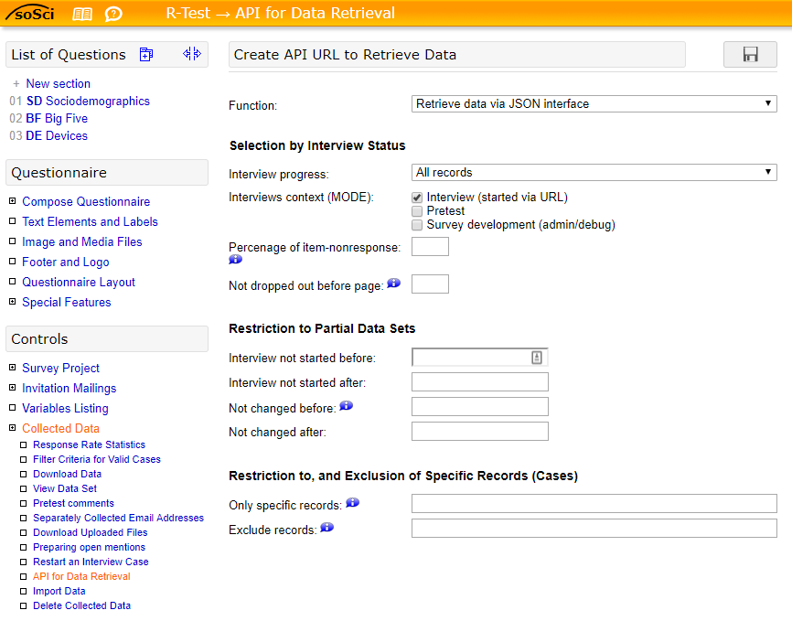

<!-- README.md is generated from README.Rmd. Please edit that file -->

```{r setup, include = FALSE}
knitr::opts_chunk$set(
  collapse = TRUE,
  comment = "#>",
  fig.path = "man/figures/README-",
  out.width = "100%"
)
```
# SoSciSurvey

This package loads data obtained with [SoSciSurvey](https://www.soscisurvey.de/en/index) into _R_ as a tidy, labelled dataset by...
 
 - grabbing the data as a JSON file via the [SoSciSurvey API](https://www.soscisurvey.de/help/doku.php/en:results:data-api)
 - turning the JSON data into a `tibble`
 - labelling the variables with `labelled::var_label()`
 - labelling variable values with `labelled::val_labels()`
 - adding user-defined missing values with `labelled::na_values()`
 - and adding further variable information (scaling, input type, question wording, system variable name) as additional attributes.
 
See [Introduction to labelled](https://cran.r-project.org/web/packages/labelled/vignettes/intro_labelled.html) for details on labelled tibbles.

## Installation

Install from GitHub:

```{r warning=FALSE, message=FALSE}
devtools::install_github("joon-e/soscisurvey")
```


## Instructions

### Preparation: Obtain API key

First, you need an API key. Head to your _SoSciSurvey_ project and select _Collected Data / API for Data Retrieval_ and click on the plus sign in the top right corner to create a new API key. Make sure that _Retrieve data via JSON interface_ is selected under _Function:_ (this should be the default setting). Select the other options to your liking. Finally, click on the save button.



This should create an API URL of the form `https://www.soscisurvey.de/[YOUR_PROJECT_NAME]/?act=[LONG_API_KEY]`. Copy this URL.

### Load data

To download your data, simply load the package and paste the API URL (in quotation marks) into the `read_sosci()` function. Let's try this with a test questionnaire containing random data of ten cases on several sociodemographic variables, device ownership and the BFI-10 short scale:

```{r load}

library(soscisurvey)
data <- read_sosci("https://www.soscisurvey.de/test166518/?act=mhBZkaKkPn1IvCWyU7296BOC")
data
```

Additional parameters offered by the [SoSciSurvey API](https://www.soscisurvey.de/help/doku.php/en:results:data-api) can be set after the API URL. Add `= TRUE`/`= FALSE` to parameters that are set without values in the API call (e.g., `vSkipTime`, `vQuality`):

```{r parameters}
data <- read_sosci("https://www.soscisurvey.de/test166518/?act=mhBZkaKkPn1IvCWyU7296BOC",
              vSkip = "QUESTNNR,MODE,STARTED",
              vSkipTime = TRUE)
data
```

The returned tibble contains variable and value labels (using the [`labelled`](https://cran.r-project.org/web/packages/labelled/) package). Value labels are visible in the console output. Variable labels are also displayed in the R data viewer (`View()`). If no labels are defined for some values, the numeric anchors as set in _SoSciSurvey_ are used (In this case, only scale extremes were labelled for the BFI-10 variables. You may note that values and labels differ for some of the scale variables, e.g., `bfi10_ext1`. This is because these variables are reverse-coded).

### Additional attributes

Apart from labelling the data, `read_sosci()` adds further variable information provided by _SoSciSurvey_ as attributes. These attributes are:

 - `var.type`: Scale type of the variable (e.g., "nominal", "ordinal", "metric", "text")
 - `var.input`: Question input format (e.g., "selection", "scale", "open")
 - `var.question`: Question wording
 - `var.sysvar`: Original (system-defined) variable name if [custom variable names](https://www.soscisurvey.de/help/doku.php/en:create:variables#custom_variable_ids) were set in _SoSciSurvey_ (e.g., "age" instead of "SD01_01")
 
```{r attributes}
attributes(data$age)
```
 

### Further data handling

#### Missing values

In most cases, _SoSciSurvey_ represents missing data with various integer codes (e.g., "-9" = "Not answered", "-1" = "Prefer not to answer"). These are defined as user-defined NA values by `labelled::na_values()` in the tibble returned by `read_sosci()`. While `is.na()` will return `TRUE` for user-defined NA values, most functions will most likely treat them as integers. You can easily convert all user-defined NA values to explicit `NA` values with `purrr::modify()` and `labelled::user_na_to_na()`.

```{r missings}
purrr::modify(data, labelled::user_na_to_na)
```

#### Labels to factors

Likewise, you may want to convert labelled variables to factors for analytical purposes (e.g., treating them as categorical variables in regression models). This can be done using `labelled::to_factor`. To ensure that only categorical variables are converted (and not, for example, scales with labelled extremes), you may use a combination of `purrr::modify_if()` and the `var.type` attribute set by `read_sosci()`:

```{r factorize}
purrr::modify_if(data, ~ attr(., "var.type") %in% c("nominal", "dichotomous"), labelled::to_factor)
```

## Acknowledgements

Many thanks to [Dominik Leiner](https://www.ls1.ifkw.uni-muenchen.de/personen/wiss_ma/leiner_dominik/index.html) for continued assistance with the SoSciSurvey API (and developing this great software in the first place).
